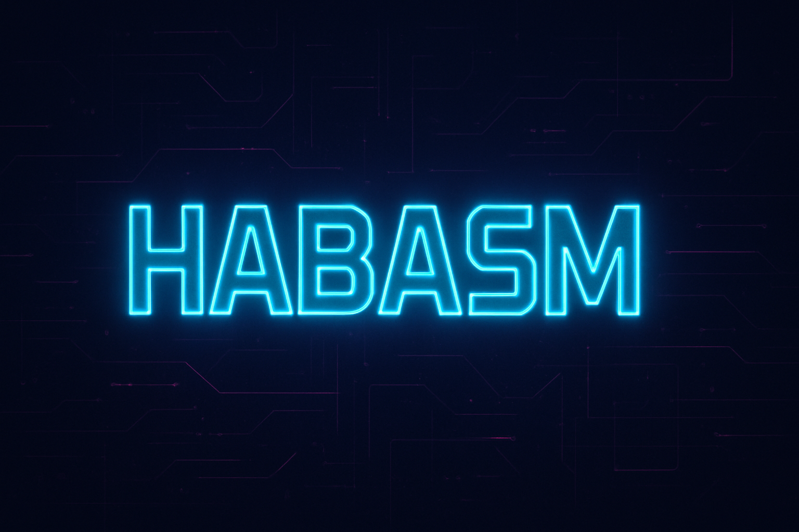

<h1 align="center">
  Hello, &lt;𝚌𝚘𝚍𝚎𝚛𝚜/&gt;! I'm <b>HABASM</b> 👨‍💻
</h1>

<h3 align="center" style="color:#ff0080;">⚡ Full-Stack Developer | Data Science Engineer | Open Source Explorer ⚡</h3>

  

---

### 🌌 About Me  

- 🔭 Currently building in **Web Development**, **AI/ML**, and **Cybersecurity**  
- 👯 Open to collaborate on **Open Source** & **Real-World Projects**  
- 💡 Passionate about **problem-solving, futuristic tech & innovation**  
- 📫 Reach me: [Email](mailto:2gethas@gmail.com) · [LinkedIn](https://www.linkedin.com/in/habitamu-asimare-aa824b169/)  
- ⚡ Fun fact: I only sleep peacefully after **all missions are completed** 🕶️  

---

### 🚀 Tech Arsenal  

  

---

### 💻 GitHub Stats  

  
  

  

---

### 🌐 Connect With Me  

  
  
  
  
  

---

  

    
  <em><b style="color:#00f0ff;">Let’s connect and build the future together 🚀</b></em>

